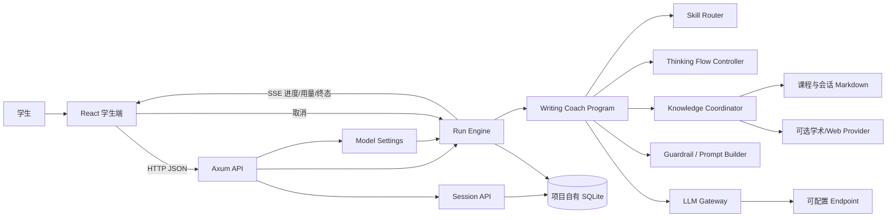

# Writing Agent Rust：设计 PDF 完整素材包

> 用途：将本文件完整交给 GPT Pro，要求其在不虚构事实的前提下整理、排版并生成课程设计文档 PDF。
>
> 项目公开仓库：<https://github.com/lijiemingjimmy/writing-agent-rust>
>
> 课程作业要求：<https://lab.cs.tsinghua.edu.cn/rust/projects/agent/requirements/>

## 0. 给 GPT Pro 的执行指令

请基于本文生成一份中文课程设计文档 PDF，建议 12–16 页。文档面向清华大学《程序设计训练（Rust）》AI Agent 大作业评审，必须覆盖：痛点分析、场景定制方案、系统架构图、关键数据结构、技术选型、R1–R6 功能证据、测试、演示用例、局限与改进方向。

生成时遵守以下约束：

1. 不得虚构作者姓名、学号、课堂、开发人时、AI Token、AI 费用、清华 Git 地址、真实用户数量或线上部署地址。
2. 所有标记为“生成 PDF 前由作者填写”的内容必须保留醒目标记，或先向作者提问。
3. 可以重写表达和改善排版，但不得把“已实现”“计划实现”和“未提供”混在一起。
4. 架构图优先把本文 Mermaid 图重绘为清晰的矢量图；表格和代码路径应保持可读。
5. 设计文档要体现作者理解，而不是堆砌代码。重点解释为什么这样设计、Rust 在哪里发挥作用、场景定制为何优于通用聊天机器人。
6. 不要把 GitHub 仓库误写成课程要求的清华 Git。清华 Git 地址未提供时，应明确列为交付前待办。

## 1. 生成 PDF 前由作者填写的信息

以下信息不能由 AI 猜测：

| 项目 | 作者填写内容 |
| --- | --- |
| 姓名 | 【待填写】 |
| 学号 | 【待填写】 |
| 院系/班级/分课堂 | 【待填写】 |
| 项目开发起止日期 | 【待填写】 |
| 清华 Git 仓库地址 | 【待创建并填写】 |
| 最终演示所用模型与 Provider | 【待填写】 |
| 实际开发人时 | 【待根据真实记录填写】 |
| AI 调用次数、Token、费用 | 【待根据真实记录填写】 |
| AI 开发工具与订阅方式 | 【待填写，例如 Codex/ChatGPT Pro】 |
| 真实痛点经历或同学反馈 | 【建议补充 1–2 个真实例子】 |
| 产品截图 | 【待用最终版本实机截图替换】 |
| 公开试用地址（如有） | 【未部署则明确写“仅提供源码本地运行”】 |

## 2. 项目基本信息

| 项目 | 内容 |
| --- | --- |
| 项目名称 | Writing Agent Rust（写作与沟通智能学伴） |
| 项目类型 | 高度场景定制的写作学习 AI Agent |
| 服务场景 | 《写作与沟通》课程中的选题收窄、论证设计、资料检索、初稿诊断、同伴互评与学术规范检查 |
| 核心后端 | Rust 2024 Edition |
| 用户界面 | React + TypeScript + Vite 学生端 Web UI |
| 数据存储 | 项目自有 SQLite 数据库 |
| 实时通信 | HTTP + Server-Sent Events（SSE） |
| 公开仓库 | <https://github.com/lijiemingjimmy/writing-agent-rust> |
| 默认分支 | `main` |
| 运行边界 | 不依赖 Python、旧项目数据库、旧 GitHub Pages 或 Mac mini |

一句话介绍：

> Writing Agent Rust 不是替学生写文章的通用聊天机器人，而是把课程写作方法、苏格拉底式追问、证据检查、课程资料检索和学术诚信边界固化进 Rust 工作流的写作学习 Agent。

## 3. 选题与痛点分析

### 3.1 具体场景

目标用户是正在完成《写作与沟通》课程任务的学生。学生通常并非完全没有想法，而是难以把模糊兴趣转化为可论证、可搜集证据、适合作业规模的研究问题。进入写作阶段后，学生还会面对观点过大、证据不足、理论硬套、结构松散、引用不规范等问题。

本项目只服务这一条学习链路：

1. 从学生的真实动机或观察出发澄清选题。
2. 给出有限的候选写作方向，而非直接生成成稿。
3. 要求学生解释选择理由并补充证据。
4. 基于课程材料、上传材料和可选公开检索提供反馈。
5. 记录每一步状态、工具调用、模型调用和费用，让过程可查看、可停止、可恢复。

### 3.2 现有通用 Agent 为什么解决不好

通用聊天模型可以回答写作问题，但在这个课程场景中有五类不足：

1. **容易越过学习过程直接代写。** 学生一句“帮我写完”就可能得到可直接提交的文章，短期省事，却没有形成选题、论证和修改能力，并带来学术诚信风险。
2. **不了解具体课程规范。** 通用模型可能混用其他课程、其他学校或网上的写作规则；当材料不足时还可能凭常识猜测字数、提交方式和评价标准。
3. **多轮状态不稳定。** 学生换题、补充证据或选择新方向后，普通对话容易继续引用旧主题，无法可靠地清除依赖状态或判断当前写作阶段。
4. **过程是黑盒。** 用户通常只能看到最后答案，不知道 Agent 做了哪些检索、处于哪个步骤、是否发生模型调用，也难以保存完整轨迹供复盘。
5. **成本与风险不可控。** 长对话可能持续消耗 Token；普通界面通常不展示输入/输出 Token、价格快照和预算停止状态，也不保证取消与最终写入的一致性。

### 3.3 项目价值

项目把“通用模型的一次回答”改造成“面向课程写作的受控学习流程”。Rust 负责不可绕过的状态推进、权限边界、工具编排、持久化、成本核算和并发取消；大模型只在受控步骤内完成语言理解与反馈生成。

## 4. 设计目标与非目标

### 4.1 设计目标

- 让学生经过动机、方向、选择理由、证据与反思等步骤形成自己的判断。
- 用课程 Skill、课程语料和会话文档约束回答来源。
- 在不回显密钥的前提下允许用户切换模型 Endpoint、Key、上下文、思考模式和价格。
- 长任务实时显示步骤、Token、费用和终态，并允许取消。
- 保存消息、状态、Skill 事件、Run 事件、工具来源和模型调用记录。
- 会话可导出为完整 JSON，也可重新导入并检查历史 Run 轨迹。
- 数据库、Git、前端和运行环境与旧 Python 项目完全隔离。

### 4.2 明确非目标

- 不生成可直接提交的完整文章。
- 不提供教师管理端、成绩管理或真实学生数据分析。
- 不默认联网；联网检索需要配置工具并获得本轮用户同意。
- 不把 API Key 写入数据库、日志、公开设置响应或会话导出。
- 不依赖原项目的 `writing_coach.db`，也不迁移真实用户数据。
- 不宣称替代教师判断；课程规则材料不足时应提示确认教师要求。

## 5. 场景定制方案

课程要求至少两项场景定制。本项目实现了以下五项，PDF 建议重点展开前四项。

### 5.1 定制一：苏格拉底写作状态机

实现位置：

- `rust-backend/src/skills/thinking_flow.rs`
- `rust-backend/src/domain/state.rs`
- `rust-backend/src/agent/writing_coach.rs`

Agent 不允许从模糊主题直接跳到总结，而是按状态推进：

```text
motivation_probe
  -> candidate_paths
  -> choice_reflection
  -> evidence_check
  -> refined_advice
  -> summary_ready
```

关键逻辑：

- 没有动机、场景或证据时，先追问真实经历和写作动机。
- 没有方向时，只提供少量带“核心问题、材料类型、风险”的候选方向。
- 学生选择方向后，必须说明选择理由。
- 没有证据时不能跳到总结，必须进入证据检查。
- 检测明确换题后，清空旧方向、旧论点和旧证据，避免上下文污染。
- 未识别的新旧阶段值可以安全保存，避免历史状态升级时丢失。

相比通用 Agent，这一逻辑把教学步骤固化为 Rust 代码，不能仅靠提示词被轻易绕过。

### 5.2 定制二：课程 Skill 路由与课程语料检索

实现位置：

- `rust-backend/src/skills/registry.rs`
- `rust-backend/src/skills/router.rs`
- `rust-backend/src/skills/prompt.rs`
- `rust-backend/src/corpus/markdown.rs`
- `skills/`
- `corpus/`
- `语料/`

系统加载 YAML Skill，根据触发词、当前上下文、待填槽位和显式用户意图选择课程能力。当前 Skill 包括：

- 写作反馈与初稿诊断
- 苏格拉底式思路推进
- 研究问题评价
- 新颖性评估
- 理论适配检查
- 方法可行性检查
- 资料与文献检索
- 文献阅读
- 同伴互评训练
- 课件问答
- 课程规则、AI 使用边界与学术规范检查

Markdown 检索支持中文 n-gram、英文 Token、稳定 glob 范围、标题与元数据权重，并把实际使用的文件记录进回答元数据。Skill 的语料路径必须留在项目根目录内，注册时会检查路径逃逸和符号链接风险。

### 5.3 定制三：不代写与证据约束 Guardrail

实现位置：

- `skills/global/no_answer_policy.yaml`
- `skills/global/question_boundary.yaml`
- `skills/global/persona.yaml`
- `rust-backend/src/skills/prompt.rs`

系统在 Prompt 和输出边界同时约束：

- 拒绝可直接提交的完整文章或完整段落代写。
- 把代写请求转化为诊断、提纲、追问、修改任务或待填模板。
- 对引用、URL、DOI 和事实性表达进行来源绑定。
- 不把“提醒用户风险的句子”误判为 Agent 正在交付违规内容。
- 材料不足时明确说出缺口，不编造课程规定或文献。
- 用户上传文档的内容被当作材料，而不是系统指令。

### 5.4 定制四：可审计、可取消、预算受控的 Agent Run

实现位置：

- `rust-backend/src/agent/run_engine.rs`
- `rust-backend/src/agent/run_context.rs`
- `rust-backend/src/store/runs.rs`
- `rust-backend/src/api/runs.rs`
- `web/src/run-state.ts`
- `web/src/components/AgentProgress.tsx`
- `web/src/components/UsageSummary.tsx`

每次任务都是一个持久化 Run，具有 `queued`、`running`、`completed`、`cancelled`、`budget_exceeded`、`failed` 六种状态。每个阶段写入单调递增的事件序号，前端用 SSE 实时接收。

核心可靠性设计：

- 同一会话只允许一个活动 Run。
- 取消使用 `CancellationToken`，并在关键写入边界再次检查。
- 取消与完成竞争时只允许一个一致的终态和一个终态事件。
- 模型用量先原子持久化，再判断是否越过预算，避免费用丢失。
- 启动时把异常中断留下的孤儿 Run 归一为失败，防止会话永久锁死。
- SSE 断线后按最后事件序号重放，忽略重复或乱序事件。

### 5.5 定制五：课程资料、会话资料与公开检索的分层工具

实现位置：

- `rust-backend/src/tools/knowledge.rs`
- `rust-backend/src/tools/scholarly.rs`
- `rust-backend/src/tools/web.rs`
- `rust-backend/src/corpus/session_documents.rs`

检索来源分为：课程 Markdown、学生当前会话上传的 TXT/Markdown、学术 Provider、通用 Web Provider。外部 Provider 可配置顺序、超时和 fallback；未安装、未配置或未获得同意时会明确记录“不可用/未尝试”，而不是假装联网成功。

## 6. 总体架构

### 6.1 组件图



### 6.2 分层职责

| 层 | 职责 | 不负责 |
| --- | --- | --- |
| React Web | 学生身份、历史列表、消息输入、进度、设置、导入导出、资料上传 | Agent 决策与业务状态推进 |
| Axum API | 参数边界、HTTP 状态、SSE、请求大小限制 | 直接编写回答 |
| Run Engine | 并发、生命周期、取消、预算、事件、模型调用记录 | 课程语义判断 |
| Writing Coach Program | 路由、状态更新、工具选择、Prompt、Guardrail | HTTP 与页面渲染 |
| Skills/Corpus | 课程能力定义、触发条件、资料范围 | 密钥和运行生命周期 |
| Store/SQLite | 会话、消息、状态、轨迹、调用、原子事务 | 业务内容生成 |
| LLM/Tools | 外部模型和检索适配 | 最终持久化策略 |

### 6.3 进程与数据边界

- Rust 服务默认监听 `127.0.0.1:3000`。
- Vite 开发服务器默认监听 `127.0.0.1:5173`，只代理 `/api` 和 `/health` 到 Rust。
- 生产前端只有一个可选 `VITE_AGENT_API_BASE_URL`，远端地址必须是无凭据、无 query、无 fragment 的 HTTPS URL。
- 默认数据库为当前课程仓库新建的 `rust_course_demo.db`。
- Git、数据库、Python 环境、教师端和旧部署配置均不共享。

## 7. 核心数据流

### 7.1 学生进入与会话恢复

1. 学生输入姓名与学号；浏览器本地保存学生 Profile。
2. 前端按学号请求会话列表。
3. 用户可新建会话、打开历史会话或导入会话 JSON。
4. 打开会话后，前端获取规范消息历史，并可检查导入的历史 Run。

### 7.2 一次 Agent 任务

1. 前端提交用户消息，Rust 原子预留 Run 与会话身份。
2. Run Engine 为本次 Run 租用模型配置和预算快照。
3. 写入 `run.started` 和步骤事件，前端开始 SSE 订阅。
4. Writing Coach 更新结构化写作上下文并决定 Skill。
5. Thinking Flow 判断当前缺失的学习步骤。
6. Knowledge Coordinator 在允许范围内搜索课程、会话或公开资料。
7. Prompt Builder 合并全局政策、Skill、私有状态和可信资料。
8. LLM Gateway 调用用户配置的模型。
9. Guardrail 检查代写、引用和事实来源边界。
10. 模型调用的输入/输出 Token、价格快照和成本写入数据库。
11. 回答、状态、Skill 事件和 Run 终态在一致边界内持久化。
12. 前端收到终态事件后刷新规范历史，展示回答与用量。

### 7.3 取消与预算停止

- 用户点击停止后调用 `POST /api/runs/{id}/cancel`。
- Rust 触发取消令牌并竞争终态事务。
- 已发生的模型调用用量仍被保留；取消后不会写入半截成功回答。
- 达到 Token 或费用预算时进入独立的 `budget_exceeded` 终态，不与普通失败混淆。

### 7.4 会话导出与导入

完整导出包含：会话、结构化状态、消息、文档、Skill 事件、Runs、Run 事件和模型调用。导入时：

- 校验 schema/version、ID、外键关系、时间、事件连续性、终态一致性和大小上限。
- 扫描密钥类字段，防止把 API Key 带入数据库。
- 生成新的会话与 Run ID，并重写内部引用。
- 任一约束失败则整个事务回滚，不产生半份导入数据。

## 8. 关键数据结构

### 8.1 `WritingContext`

用于持久化写作过程，而不是只保存聊天文本。主要字段包括：

- `stage`
- `topic`
- `motivation`
- `observed_scene`
- `candidate_paths`
- `selected_direction` / `selected_path`
- `choice_reason`
- `research_question`
- `core_claim`
- `evidence_items`
- `thinking_stage` / `flow_stage`

设计意义：学生换题时可以精确清除依赖字段；Agent 可判断下一步缺什么；恢复会话后不会只靠重新阅读全部聊天猜状态。

### 8.2 `AgentRun`

保存一次任务的生命周期、当前步骤、最大步骤、Token/费用预算、累计用量、取消原因、错误与时间戳。

### 8.3 `RunEvent`

由 `run_id + seq + kind + payload + created_at` 组成。`seq` 单调递增，用于 SSE 重放、去重、断线恢复和轨迹展示。

### 8.4 `ModelCallRecord`

每次外部模型调用独立记录：用途、Provider、模型、输入 Token、输出 Token、输入/输出单价快照、整数微美元成本、耗时、finish reason 和安全的 response ID。

### 8.5 `PublicModelSettings`

可公开字段包括 Provider、Endpoint、模型名、密钥环境变量名、是否已配置密钥、上下文长度、最大输出、思考模式、价格和默认预算。API Key 本身不在公开结构中。

## 9. SQLite 数据模型

| 表 | 用途 |
| --- | --- |
| `sessions` | 会话身份、任务类型、阶段和时间 |
| `messages` | 用户/助手消息及元数据 |
| `session_states` | 结构化写作状态 JSON |
| `documents` | 会话上传的文本或 Markdown |
| `skill_events` | Skill 选择和执行记录 |
| `agent_runs` | Run 生命周期、预算、累计用量和终态 |
| `run_events` | 有序步骤、用量、警告与终态事件 |
| `model_calls` | 每次模型调用的 Token、价格和成本 |

SQLite 配置启用外键、WAL、busy timeout 和自动迁移。金额统一用整数“微美元”存储，避免浮点累计误差。

## 10. HTTP API

| 方法与路径 | 用途 |
| --- | --- |
| `GET /health` | Rust 服务健康检查 |
| `POST /api/chat` | 等待式兼容聊天接口 |
| `POST /api/runs` | 创建异步 Agent Run |
| `GET /api/runs/{id}` | 获取 Run 快照 |
| `GET /api/runs/{id}/events` | SSE 订阅或重放事件 |
| `POST /api/runs/{id}/cancel` | 取消 Run |
| `GET /api/sessions?user_id=...` | 列出学生会话 |
| `POST /api/sessions` | 新建会话 |
| `GET /api/sessions/{id}/messages` | 获取规范消息历史 |
| `POST /api/sessions/{id}/documents` | 上传 TXT/Markdown 资料 |
| `GET /api/sessions/{id}/export` | 导出完整会话 JSON |
| `POST /api/sessions/import` | 导入完整会话 JSON |
| `GET /api/settings/model` | 读取安全的模型配置 |
| `PUT /api/settings/model` | 原子更新运行时模型配置 |

API 对无效 JSON、超大请求、无效 ID、活动 Run 冲突、预算终止和上游模型失败使用明确且不泄密的错误响应。

## 11. R1–R6 要求对照

| 要求 | 实现 | 代码证据 | 建议演示 |
| --- | --- | --- | --- |
| R1 核心逻辑用 Rust | 路由、状态机、工具编排、模型调用、Guardrail、存储、预算均由 Rust 控制 | `rust-backend/src/agent/`、`skills/`、`store/`、`tools/` | 展示一次任务事件和数据库轨迹 |
| R2 用户交互界面 | React 学生端可触发任务并展示结果 | `web/src/pages/StudentChat.tsx` | 输入姓名学号并发起对话 |
| R3 自定义模型配置 | UI/TOML 支持 Endpoint、Key、上下文、输出、思考模式、价格、预算 | `config.example.toml`、`ModelSettings.tsx`、`llm/settings.rs` | 切换 Endpoint，显示 Key 不回显 |
| R4 实时进度与打断 | SSE 事件、断线重放、步骤进度、停止按钮和取消终态 | `api/runs.rs`、`run_engine.rs`、`AgentProgress.tsx` | 启动任务后点击停止 |
| R5 上下文历史管理 | 历史列表、结构化状态、完整 JSON 导入导出、历史 Run 轨迹 | `store/sessions.rs`、`StudentChat.tsx` | 导出后再导入并打开轨迹 |
| R6 Token 与价格 | 逐调用输入/输出 Token、价格快照、整数成本、累计用量和预算停止 | `model_usage.rs`、`store/runs.rs`、`UsageSummary.tsx` | 展示一次调用和累计费用 |

## 12. 技术选型

### 12.1 Rust crates

| crate | 用途 | 选择理由 |
| --- | --- | --- |
| Axum | HTTP API、路由、SSE | 与 Tokio 集成自然，类型边界清晰 |
| Tokio / tokio-util | 异步运行时、网络、取消令牌 | 支持长任务、并发与可靠取消 |
| SQLx + SQLite | 数据持久化、事务、迁移 | 编译期/运行时类型支持好，部署简单，适合课程单机演示 |
| Serde / serde_json / serde_yaml | API、状态、Skill、导入导出 | 统一结构化数据边界 |
| genai | 多 Provider 模型调用抽象 | 支持 OpenAI-compatible 等模型适配 |
| Reqwest | 学术与 Web Provider HTTP 客户端 | Rustls TLS、JSON 支持成熟 |
| tower-http | CORS | 与 Axum 中间件生态一致 |
| thiserror | 错误类型 | 明确区分配置、数据库、模型与业务错误 |
| tracing | 运行日志 | 结构化、可按环境过滤 |
| Chrono / UUID | 时间与 ID | 持久化轨迹需要稳定时间和唯一标识 |
| Regex / Glob | 文本规范化与语料范围 | 支持课程 Markdown 的规则与范围匹配 |

### 12.2 Web 技术

| 技术 | 用途 | 选择理由 |
| --- | --- | --- |
| React 19 | 学生界面 | 组件化管理会话、进度、设置和用量 |
| TypeScript | API 与状态类型 | 减少 SSE、Run 状态和导入导出字段错误 |
| Vite | 开发与生产构建 | 启动快、配置小、易于课程演示 |
| React Markdown + remark-gfm | 回答展示 | 支持表格、列表、代码等写作反馈格式 |
| Node test runner | 前端逻辑和边界测试 | 无需额外测试框架即可验证纯逻辑与源码契约 |

### 12.3 为什么前端不强行使用 Rust

课程允许 React/TypeScript 作为 UI，只要求 Agent 核心逻辑由 Rust 实现。本项目把所有可影响业务结果的决策留在 Rust，前端只负责输入、渲染和调用 API，因此既满足 R1，也避免为了“全 Rust”牺牲界面开发效率。

## 13. 安全、隐私与可靠性

### 13.1 密钥安全

- API Key 默认从环境变量读取，也可作为内存中的临时运行配置。
- 公共设置只返回 `api_key_configured`，不返回 Key。
- Debug 输出、错误、会话导出和导入均做密钥边界处理。
- 远端 API Base 和模型 Endpoint 有 URL、协议、凭据、query 与 fragment 校验。

### 13.2 数据边界

- 不包含原 `writing_coach.db`、WAL、SHM 或 journal。
- 不包含真实学生案例；Skill 所需例子改用合成样例。
- 文档上传只接收有界 TXT/Markdown，不保存客户端路径。
- 会话导入有记录数、字节数、ID、时间、外键和秘密材料校验。

### 13.3 Git 与部署边界

- 新项目拥有独立 `.git`、单一 worktree 和独立 remote。
- GitHub remote 仅指向 `writing-agent-rust`。
- 不含旧 GitHub Pages、旧域名、Mac mini 或 Python 部署配置。
- `scripts/check-isolation.sh` 自动检查 remote、数据库、符号链接、绝对路径和旧服务标记。

### 13.4 并发与事务可靠性

- 同会话活动 Run 冲突被拒绝。
- 终态写入与终态事件在事务中保持一致。
- 模型用量、Run 总量与用量事件保持原子一致。
- 导入、导出与取消竞争有专门测试覆盖。
- 服务重启会清理孤儿 Run 状态。

## 14. 测试与质量证据

最终验证命令：

```bash
bash scripts/verify-course.sh
```

该脚本依次执行：

1. Git/路径/数据库/前端耦合隔离检查。
2. `cargo fmt --check`。
3. `cargo clippy --all-targets --all-features -- -D warnings`。
4. `cargo test --all-targets`。
5. `npm ci`。
6. 36 个 Web 测试。
7. Vite 生产构建。
8. 构建后的再次隔离检查。

截至 2026-08-26 的已验证结果：

- Rust：204 个测试通过，0 失败。
- Web：36 个测试通过，0 失败。
- Clippy：在 `-D warnings` 下通过。
- npm audit：0 个已知漏洞。
- Vite：288 个模块生产构建成功。
- 浏览器：桌面入口、390px 窄屏和学生主界面正常，无 Vite error overlay。
- 真实本地链路：前端经 Vite 访问 Rust，会话列表 API 返回 200。
- 独立启动：Rust 使用全新临时 SQLite 返回 `writing-coach-rust / ok`。

主要测试类别：

- Skill 路由、槽位追问、换题、写作状态机。
- Prompt 私有状态边界和防代写 Guardrail。
- 模型配置、密钥脱敏、Endpoint 策略、价格溢出。
- Token/费用核算、预算越界和持久化事务。
- Run 创建、SSE 重放、断线、取消与并发终态竞争。
- 会话上传、导出、导入、秘密扫描与全事务回滚。
- 课程/会话/学术/Web 检索、Provider fallback 和取消。
- 学生 UI、Profile、API Base、进度状态和学生端边界。

## 15. 推荐演示用例

### 15.1 用例 A：苏格拉底选题推进（主演示）

初始输入：

> 我想写“大学生为什么喜欢找搭子”，但还不知道怎么收窄。

演示步骤：

1. Agent 不直接写文章，先追问真实经历或动机。
2. 学生补充一个具体场景。
3. Agent 给出“边界区分、功能替代、关系转化”等有限候选方向。
4. 学生选择一个方向但不解释原因。
5. Agent 进入 `choice_reflection`，要求说明理由。
6. 学生说明理由但没有证据。
7. Agent 进入 `evidence_check`，提示可用访谈、经历或课程材料。
8. 补充证据后请求总结，Agent 才生成研究问题、论证路径和下一步任务。

展示重点：这不是依赖 Prompt 的普通问答，而是 Rust 状态机控制的课程学习流程。

### 15.2 用例 B：课程资料与初稿诊断

输入一段虚构草稿，并提问：

> 请帮我诊断这段文字的核心论点、证据和结构问题，不要替我重写。

展示：

- 路由到初稿诊断或写作反馈 Skill。
- 反馈引用课程语料或上传资料。
- 输出问题定位、证据缺口和修改任务，不输出完整替换段落。

### 15.3 用例 C：实时进度和取消

1. 发起需要模型或检索的任务。
2. 展示步骤事件和运行状态。
3. 点击停止。
4. 展示 `cancelled` 终态，与 `failed`、`budget_exceeded` 区分。
5. 刷新页面，确认历史轨迹仍存在且没有半截助手回答。

### 15.4 用例 D：模型设置与费用

1. 打开模型设置。
2. 展示 Endpoint、模型名、Key、上下文、最大输出、思考模式、输入/输出价格和预算。
3. 保存设置，证明 Key 不回显。
4. 发起新 Run，展示输入/输出 Token、单次费用、累计费用和预算。

### 15.5 用例 E：完整会话导出/导入

1. 在已有对话中导出 JSON。
2. 切换学生或清空当前选择。
3. 导入 JSON。
4. 展示消息、结构化状态、资料、Run 轨迹和用量均被恢复。
5. 选择某个导入 Run，检查其事件序列。

## 16. 编译、配置与运行

### 16.1 环境

- Rust 1.85 或更新版本。
- Node.js 22 或更新版本。
- 一个 OpenAI、DeepSeek 或 OpenAI-compatible 模型 Endpoint。
- 不需要 Python、旧项目数据库或外部部署服务。

### 16.2 启动 Rust

```bash
cp rust-backend/config.example.toml rust-backend/config.toml
export WRITING_COACH_MODEL_API_KEY='your-runtime-key'
cargo run --manifest-path rust-backend/Cargo.toml
```

默认监听 `127.0.0.1:3000`，并创建课程项目自己的 `rust_course_demo.db`。

### 16.3 启动 Web

```bash
cd web
npm ci
npm run dev
```

浏览器打开 <http://127.0.0.1:5173>。

### 16.4 验证

```bash
bash scripts/verify-course.sh
```

## 17. 仓库与代码导航

公开 GitHub：<https://github.com/lijiemingjimmy/writing-agent-rust>

| 目录/文件 | 内容 |
| --- | --- |
| `rust-backend/src/agent/` | Agent Run 与写作主控 |
| `rust-backend/src/skills/` | Skill 注册、路由、Prompt、思考流程 |
| `rust-backend/src/tools/` | 课程、学术和 Web 工具协调 |
| `rust-backend/src/store/` | SQLite 会话和 Run 事务 |
| `rust-backend/src/api/` | HTTP、SSE、设置、会话 API |
| `rust-backend/src/llm/` | 模型配置、Gateway、价格 |
| `rust-backend/src/domain/` | ID、状态、Run、会话领域结构 |
| `rust-backend/migrations/` | SQLite schema |
| `rust-backend/tests/` | Rust 集成与契约测试 |
| `web/src/` | 学生端 UI、API 客户端与 Run 状态 |
| `web/scripts/` | Web 逻辑与边界测试 |
| `skills/` | 课程 Skill YAML |
| `corpus/` / `语料/` | 合成样例与课程 Markdown |
| `scripts/check-isolation.sh` | 独立仓库与数据边界审计 |
| `scripts/verify-course.sh` | 一键完整验收 |
| `THIRD_PARTY.md` | 依赖与复用来源说明 |

课程要求源代码最终提交到清华 Git。当前材料只知道 GitHub 地址，不能替作者创建或猜测清华 Git URL。

## 18. 第三方依赖、复用与学术诚信

- 开源依赖列在 `Cargo.lock` 与 `package-lock.json`，主要 crate/package 已在 `THIRD_PARTY.md` 说明。
- 项目复用了作者此前项目中的学生端界面、Skill 配置、课程语料组织方式和部分业务测试思路。
- Rust Agent 主控、Run 生命周期、取消、Token/费用、会话轨迹与 Rust API 是本课程仓库的实现主体。
- 没有复制旧 Git 历史、Python 服务、教师端、原数据库、真实用户数据或旧部署配置。
- AI 辅助开发受到课程鼓励，但作者必须理解并能解释提交的每一行 Rust 代码。
- AI 对话历史必须提交真实原始记录，不得用本文伪造对话、时间戳、Token 或费用。

## 19. 已知限制与风险

这些内容应诚实写入设计文档：

1. 最终回答质量仍受用户选择的模型影响；没有有效模型 Endpoint/Key 时只能完成不需要模型的本地状态与检索逻辑。
2. 当前资料上传只支持有界 TXT/Markdown，不解析 PDF、Word 或图片。
3. 当前 Web 是本地运行的学生端，没有包含教师端或生产部署工作流。
4. 外部学术和 Web Provider 需要单独配置，网络不可用时会降级到本地资料。
5. SQLite 适合课程单机演示；多机部署需要换用共享数据库并重新设计锁和迁移策略。
6. 课程语料发布前应由作者确认拥有公开使用权限。
7. 正式清华 Git、AI 原始对话和真实开发成本数据尚需作者补充。

## 20. 可选后续改进

- 增加 PDF/Word 文档解析，并保留安全的页码/段落引用。
- 增加课程 Rubric 的结构化可视化评分，但保持“诊断而非代写”。
- 为公开试用提供容器化部署和只读演示数据。
- 增加会话内语料索引和更大规模的检索性能评测。
- 增加可导出的学习过程报告，帮助学生反思如何形成论点和证据。
- 在用户授权下加入更多课程专用工具，但继续保留默认不联网原则。

## 21. 设计 PDF 推荐目录与页数

| 页码建议 | 内容 |
| --- | --- |
| 1 | 封面：项目名、作者、学号、课程、仓库 |
| 2 | 摘要与具体痛点 |
| 3 | 通用 Agent 的不足与项目目标 |
| 4–5 | 五项场景定制，重点讲状态机、Skill/语料、Guardrail |
| 6 | 总体架构图与模块边界 |
| 7 | 一次 Agent Run 的数据流和取消流程 |
| 8 | 关键数据结构与 SQLite schema |
| 9 | R1–R6 对照表 |
| 10 | 技术选型及 Rust 工程设计 |
| 11 | 安全、隐私、隔离与可靠性 |
| 12 | 测试结果和质量保障 |
| 13 | 演示用例和界面截图 |
| 14 | 局限、改进方向、总结 |
| 附录 | API、运行方式、依赖与开源复用 |

## 22. 五分钟课堂展示逻辑

建议时间分配：

1. **0:00–0:40 痛点。** 普通聊天机器人容易代写、不懂课程规则、多轮状态漂移、过程与费用不可见。
2. **0:40–1:20 方案。** 用 Rust 状态机、Skill/课程语料、Guardrail 和可取消 Run 固化学习流程。
3. **1:20–3:40 主演示。** 完成“搭子”选题的动机追问、方向选择、理由、证据检查；同时展示进度和用量。
4. **3:40–4:20 工程能力。** 模型配置、取消、历史轨迹、JSON 导入导出。
5. **4:20–5:00 架构与总结。** Rust 主控、React 只做 UI；展示测试数量、隔离边界和项目仓库。

答辩准备问题：

- 为什么不只靠 Prompt？哪些约束是 Rust 代码保证的？
- 取消与完成同时发生时如何保证一致？
- Token 和价格为什么用整数微美元？
- 换题后如何避免旧上下文污染？
- API Key 为什么不会出现在设置响应和会话导出中？
- Skill 路由、课程语料和通用聊天机器人有什么本质差别？
- 哪些代码是复用的，哪些是本次 Rust 大作业的核心？
- 如果把 SQLite 换成多用户服务，需要改什么？

## 23. 最终提交清单

### 23.1 源代码仓库

- [x] GitHub 公开仓库可访问：<https://github.com/lijiemingjimmy/writing-agent-rust>
- [x] 根 README 包含编译、配置和运行方法。
- [x] `Cargo.lock` 和 `package-lock.json` 已提交。
- [x] Rust、Web、Skill、语料、迁移和测试已提交。
- [x] 第三方依赖和复用来源有说明。
- [x] 不包含数据库、密钥、真实用户数据和旧部署配置。
- [ ] 创建清华 Git 仓库并填写地址。
- [ ] 将最终源码推送到清华 Git，确认助教可访问。

### 23.2 设计文档 PDF

- [x] 本文已提供完整 PDF 事实素材。
- [ ] 作者填写姓名、学号、班级和真实痛点例子。
- [ ] 加入最终界面、进度、模型设置和用量截图。
- [ ] 用 GPT Pro 生成初版 PDF。
- [ ] 作者逐段审核，确保理解、无虚构、无过时数据。
- [ ] 检查架构图、表格、中文字体、页码和链接。
- [ ] 导出最终 PDF 并在不同设备打开检查。

### 23.3 AI 原始对话历史

- [ ] 从实际开发工具导出完整原始对话。
- [ ] 保留原始时间顺序、消息角色和时间戳。
- [ ] 不删除失败尝试，不伪造或改写记录。
- [ ] 检查记录中是否意外含 API Key、密码或真实用户隐私；如课程允许脱敏，应记录脱敏规则，不得改变开发事实。
- [ ] 按网络学堂允许的 Markdown/JSON/PDF 格式提交。

### 23.4 AI 开发开销 Excel

- [ ] 按需求分析、架构设计、Rust 核心、UI、测试调试、文档展示分阶段统计。
- [ ] 填写每阶段真实人时。
- [ ] 填写真实 API 调用次数、输入/输出/总 Token。
- [ ] 填写模型名称、AI 工具、费用 USD/CNY 或订阅额度说明。
- [ ] 说明无法从订阅工具精确还原的字段，不得猜测。
- [ ] 校验合计公式和币种。

### 23.5 公开展示与课堂演示

- [ ] 发布设计文档摘要和开放访问的项目链接。
- [ ] 至少试用 3 位同学作品并提交真实反馈。
- [ ] 准备稳定的模型 Key 和备用 Endpoint。
- [ ] 提前创建演示会话，准备可重复输入。
- [ ] 演练 5 分钟流程，确保不依赖临场生成长答案。
- [ ] 准备无网络时的截图或录屏备份。
- [ ] 能解释核心 Rust 模块、取消竞争、状态机、数据库和 Token 费用。

### 23.6 最终技术验收

- [ ] 从干净 clone 按 README 启动。
- [ ] `bash scripts/verify-course.sh` 全绿。
- [ ] 使用新的演示数据库，不接触任何旧数据库。
- [ ] 检查 Git 中没有 `config.toml`、`.env`、数据库或 Key。
- [ ] `scripts/check-isolation.sh` 通过。
- [ ] 检查 GitHub 与清华 Git 的最终分支和提交一致。
- [ ] 检查 PDF、AI 历史、Excel 和源码地址均能打开。

## 24. 最终总结素材

Writing Agent Rust 的核心贡献不是“用 Rust 包一层聊天 API”，而是把课程写作的学习流程转化为可执行、可检查、可恢复的 Agent 系统：Rust 状态机控制学生必须经历的思考步骤；Skill 和课程语料提供场景知识；Guardrail 防止代写和无来源断言；Run Engine 让进度、取消、Token、费用和终态成为可靠数据；完整轨迹导入导出让 Agent 的工作流程不再是黑盒。

这套设计体现了 Rust 在所有权、异步、并发、错误边界、事务和工程化方面的价值，同时保留 React 作为成熟 UI 技术栈。它针对《写作与沟通》这一具体场景做了多项不可由通用 Agent 自动保证的定制，符合课程“真实、具体、至少两项专门优化”的核心要求。
